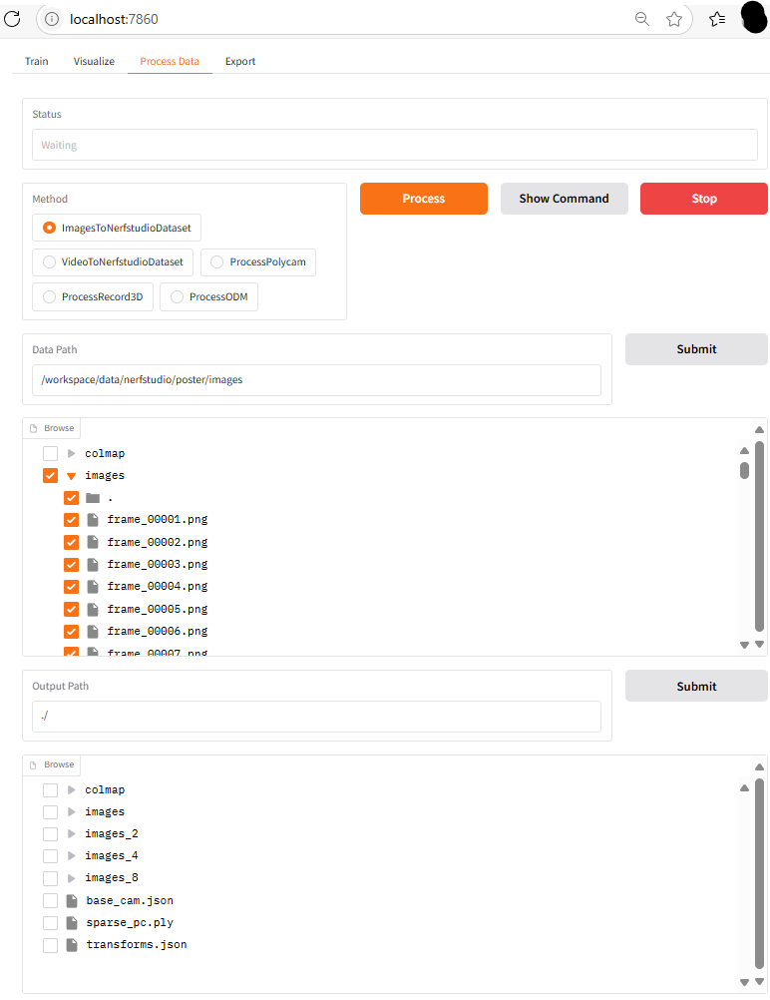
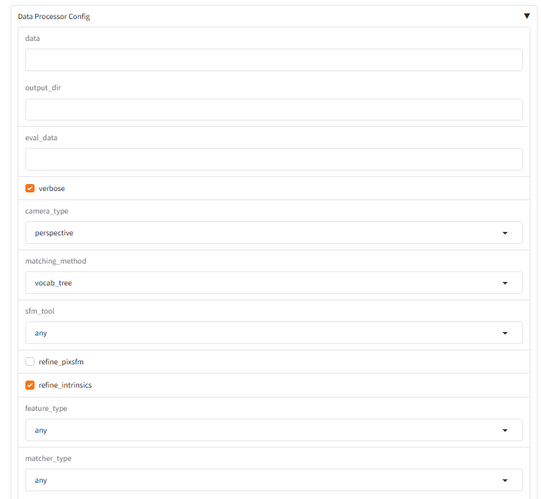

<!-- docs/tutorials/quickstart.md -->

# Quick-start

Get up and running in just a few steps—process a dataset and preview it.

## 1. Launch the WebUI

```bash
python webui.py --root-dir <your folder>
```

> Add `--help` for additional flags.

## 2. Open in your browser

Navigate to:

```
http://localhost:7860
```

## 3. Process your data

1. Click the **Process Data** tab.  
2. In **Data path**, enter the folder containing your images or video. Click Submit.  
3. In **Output path**, choose an empty folder for results. Click **Submit**.  
   
4. Select your **Processing method** (e.g. “Images → Nerfstudio (COLMAP)”). Customize its arguments expanding **Data Processor Config**
    
5. Click **Process**.  
6. Watch the status box for periodic updates—processing logs will appear here.

## 4. Train Splat/Nerf
1. Click the **Train** tab. Repeat steps, as **Data Path** folder select one with the transforms. (see original ns-train in Nerfstudio docs)


## 5. Preview with Viser

1. Do not use the webUI. Open localhost:7007

## 6. Export Splat/Nerf/video
1. Use the viser option. *Not tested*


---

Enjoy your first run of the Nerfstudio Gradio WebUI! 🎉  
